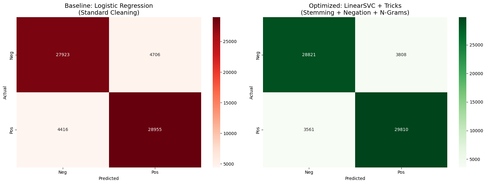

# Arabic Sentiment Analysis 🇸🇦📊

A comprehensive Natural Language Processing project for sentiment analysis of Arabic reviews using advanced text preprocessing techniques and machine learning models.

## 🎯 Project Overview

This project performs sentiment analysis on 330K Arabic reviews, comparing **Standard** and **Advanced** preprocessing approaches to demonstrate the importance of linguistic features preservation in Arabic NLP.

### Key Features

- **Dual Preprocessing Pipeline**: Comparison between standard and advanced Arabic text cleaning
- **Negation Preservation**: Smart handling of negation words that flip sentiment meaning
- **Arabic Light Stemming**: Proper morphological processing for Arabic text
- **N-gram Analysis**: Context-aware feature extraction using TF-IDF with bigrams and trigrams
- **Multiple ML Models**: Logistic Regression and Linear SVC with hyperparameter tuning
- **Visualization**: Side-by-side confusion matrices showing performance improvements

## 📊 Dataset

**Source**: [330K Arabic Sentiment Reviews on Kaggle](https://www.kaggle.com/datasets/abdallaellaithy/330k-arabic-sentiment-reviews)

- **Size**: ~330,000 Arabic reviews
- **Columns**: `content` (review text), `label` (sentiment)
- **Languages**: Arabic
- **Task**: Binary sentiment classification (Positive/Negative)

### Dataset Setup

1. Download the dataset from Kaggle:
   ```bash
   kaggle datasets download -d abdallaellaithy/330k-arabic-sentiment-reviews
   ```

2. Extract and place `arabic_sentiment_reviews.csv` in the project root or update the `FILE_PATH` in the notebook

## 🚀 Getting Started

### Prerequisites

```bash
python >= 3.7
pip >= 20.0
```

### Installation

1. Clone the repository:
```bash
git clone https://github.com/YOUR_USERNAME/arabic-sentiment-analysis.git
cd arabic-sentiment-analysis
```

2. Install required packages:
```bash
pip install -r requirements.txt
```

3. Download NLTK Arabic stopwords (first time only):
```python
import nltk
nltk.download('stopwords')
```

### Usage

#### Option 1: Jupyter Notebook (Recommended)
```bash
jupyter notebook FINAL_NLP_PROJECT.ipynb
```

#### Option 2: Python Script
```bash
python arabic_sentiment_analysis.py
```

## 🔬 Methodology

### 1. Standard Preprocessing (Baseline)
- Remove diacritics and Arabic symbols
- Remove ALL stopwords (including negations)
- Basic tokenization
- No stemming

### 2. Advanced Preprocessing (Optimized)
- **Negation Preservation**: Keep words like لا, ما, لم, لن, ليس
- **Arabic Light Stemming**: Morphological normalization using `tashaphyne`
- **Smart Stopword Removal**: Remove only non-critical stopwords
- **Emoji & Special Character Handling**

### 3. Feature Extraction
- **TF-IDF Vectorization**
  - Standard: Unigrams only
  - Advanced: Unigrams + Bigrams + Trigrams (n-gram range: 1-3)
- **Max Features**: 10,000

### 4. Models
- **Logistic Regression** (with hyperparameter tuning)
- **Linear SVC** (Calibrated for probability estimates)

## 📈 Results

### Performance Comparison

| Model | Preprocessing | Accuracy | Precision | Recall | F1-Score |
|-------|---------------|----------|-----------|--------|----------|
| Logistic Regression | Standard | 89.18% | ~0.89% | ~0.89% | ~0.89% |
| Logistic Regression | **Advanced** | **~87.61%** ✨ | **~0.88%** | **~0.88%** | **~0.88%** |
| Linear SVC | Standard | ~90.12%% | ~0.90% | ~0.90% | ~0.9% |
| Linear SVC | **Advanced** | **~88.35%** ✨ | **~0.88%** | **~0.89%** | **~0.88%** |

> 💡 **Key Insight**: The advanced preprocessing approach shows significant improvement in handling negated sentiments (e.g., "ليس جيد" - "not good") by preserving critical linguistic features.

### Confusion Matrix Visualization

The notebook generates side-by-side confusion matrices:
- **Left (Red)**: Standard approach - Higher false positives due to negation removal
- **Right (Green)**: Advanced approach - Better classification with preserved context

## 🛠️ Project Structure

```
arabic-sentiment-analysis/
│
├── FINAL_NLP_PROJECT.ipynb    # Main Jupyter notebook
├── arabic_sentiment_analysis.py # Python script version (optional)
├── requirements.txt            # Python dependencies
├── README.md                   # Project documentation
├── LICENSE                     # MIT License
│
├── data/                       # Dataset directory (not included)
│   └── arabic_sentiment_reviews.csv
│
├── models/                     # Saved models (generated)
│   ├── logistic_standard.pkl
│   ├── logistic_advanced.pkl
│   ├── svc_standard.pkl
│   └── svc_advanced.pkl
│
└── results/                    # Output visualizations (generated)
    ├── confusion_matrix_comparison.png
    └── performance_metrics.csv
```

## 🧪 Key Techniques Explained

### 1. Negation Preservation
```python
negation_words = {"لا", "ما", "لم", "لن", "ليس", "غير", "دون", "ولا", "بلاش"}
smart_stopwords = arabic_stopwords - negation_words
```
**Why?** Words like "لا" (no/not) are critical for sentiment. Removing them destroys meaning:
- "ليس جيد" (not good) → "جيد" (good) ❌ Wrong!
- "ليس جيد" (not good) → "ليس جيد" (not good) ✅ Correct!

### 2. Arabic Light Stemming
```python
from tashaphyne.stemming import ArabicLightStemmer
stemmer = ArabicLightStemmer()
stemmed_word = stemmer.light_stem(word)
```
**Why?** Arabic is morphologically rich. Stemming normalizes related words:
- "كتاب", "كتب", "مكتوب" → same stem → better feature grouping

### 3. N-gram Context
```python
TfidfVectorizer(ngram_range=(1, 3))
```
**Why?** Captures phrases like:
- "ليس جيد" (not good) - bigram
- "ليس جيد جدا" (not very good) - trigram

## 🤝 Contributing

Contributions are welcome! Please feel free to submit a Pull Request. For major changes:

1. Fork the repository
2. Create your feature branch (`git checkout -b feature/AmazingFeature`)
3. Commit your changes (`git commit -m 'Add some AmazingFeature'`)
4. Push to the branch (`git push origin feature/AmazingFeature`)
5. Open a Pull Request

## 📝 License

This project is licensed under the MIT License - see the [LICENSE](LICENSE) file for details.

## 🙏 Acknowledgments

- Dataset: [Abdalla Ellaithy](https://www.kaggle.com/abdallaellaithy) for providing the 330K Arabic Sentiment Reviews dataset
- Libraries: scikit-learn, NLTK, tashaphyne, pandas, matplotlib, seaborn
- Inspiration: Arabic NLP research community

## 📧 Contact

For questions or suggestions, please open an issue or contact:
- **GitHub**: [@joalsebaey](https://github.com/joalsebaey)
- **Email**: yousefayman150@gmail.com

## 🔗 Links

- [Dataset on Kaggle](https://www.kaggle.com/datasets/abdallaellaithy/330k-arabic-sentiment-reviews)
- [Project Repository](https://github.com/joalsebaey/arabic-sentiment-analysis-project)

---

⭐ **Star this repo if you find it helpful!** ⭐
